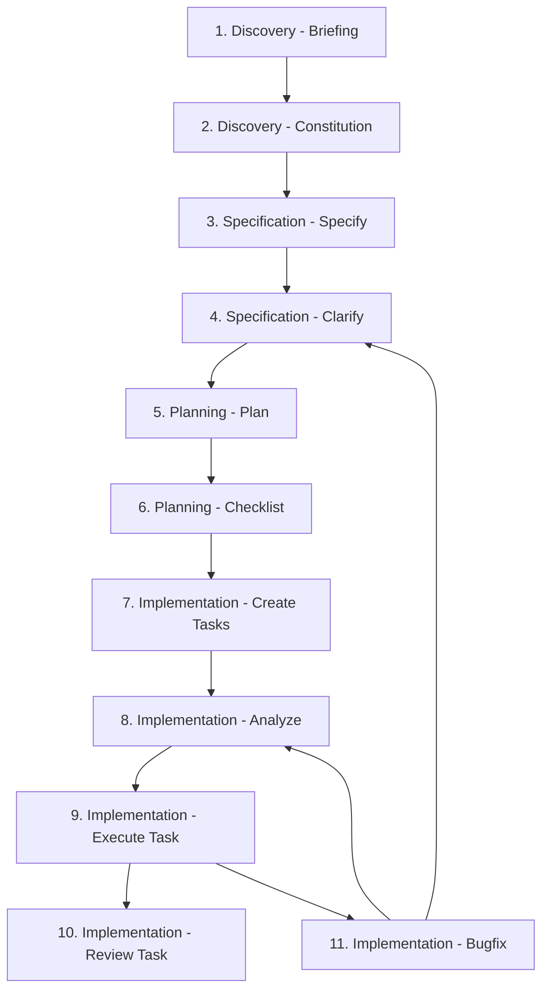

# Sapient-AI

Repositorio de definicoes, instrucoes, agents, skills e profiles para configurar e melhorar o uso de plataformas de IA, com foco inicial em Codex.

Este repositorio nao e uma aplicacao executavel. Ele funciona como um acervo versionado de arquivos que orientam agentes, ferramentas e fluxos de trabalho baseados em IA.

> [!NOTE]
> O Sapient-AI tem como base as skills e funcionalidades do [Claude Code Toolkit (cstk)](https://github.com/JotJunior/cstk), projeto criado e mantido por [João Zanon (JotJunior)](https://github.com/JotJunior). O projeto de origem é distribuído sob a [licença MIT](https://github.com/JotJunior/cstk/blob/main/LICENSE).

## Proposito

O objetivo do Sapient-AI e centralizar configuracoes e instrucoes reutilizaveis para evitar arquivos dispersos, facilitar evolucao incremental e manter uma organizacao clara por plataforma.

O repositorio deve ser util desde o primeiro artefato publicado. A estrutura pode evoluir conforme surgirem novas necessidades, novos agents, novas skills e novos profiles.

## Escopo

Este repositorio deve conter:

- instrucoes globais de usuario;
- definicoes de agents;
- colecoes de skills;
- profiles e configuracoes por plataforma;
- instrucoes por projeto ou por tipo de projeto;
- documentos auxiliares sobre uso, convencoes e organizacao.

Este repositorio nao tem como objetivo:

- entregar uma aplicacao executavel;
- manter metas de produto, prazo ou escopo fechado;
- cobrir todas as plataformas de IA desde o inicio;
- armazenar credenciais, dados sensiveis ou informacoes privadas.

## Estrutura Atual

A organizacao primaria do repositorio e por plataforma. Dentro de cada plataforma, os artefatos sao agrupados por contexto, funcionalidade ou fluxo de trabalho.

```text
codex/
  agentes/
    README.md
  skills/
    dev-pipeline/
      1-discovery-briefing/
        agents/
        references/
        SKILL.md
      2-discovery-constitution/
        evals/
        templates/
        SKILL.md
docs/
  briefing/
```

### `codex/`

Agrupa artefatos especificos para Codex. Esta e a plataforma inicial e principal do repositorio.

### `codex/agentes/`

Agrupa definicoes de agentes customizados para Codex. Use esta pasta para agentes independentes das skills ou para composicoes que coordenem multiplas skills.

### `codex/skills/`

Agrupa colecoes de skills para Codex, separando os fluxos reutilizaveis das definicoes de agentes.

### `codex/skills/dev-pipeline/`

Agrupa skills, agents, referencias, templates e avaliacoes relacionadas ao pipeline de desenvolvimento usado com Codex.

## Fluxo Dev Pipeline

O conjunto `codex/skills/dev-pipeline/` documenta um fluxo SDD completo para conduzir trabalho de desenvolvimento com Codex, desde discovery ate execucao, revisao e correcao de bugs. A regra geral e avancar de contexto para governanca, requisitos, planejamento, backlog e implementacao, usando analises read-only como gates antes de alterar codigo.



Resumo das etapas:

- `1-discovery-briefing`: captura visao, usuarios, escopo, restricoes, contexto tecnico, qualidade e evolucao esperada.
- `2-discovery-constitution`: transforma o contexto em principios de governanca, qualidade, arquitetura e processo.
- `3-specification-specify`: cria uma spec funcional focada no que a feature deve entregar e por que ela existe.
- `4-specification-clarify`: resolve ambiguidades de uma spec existente e integra as respostas no proprio documento.
- `5-planning-plan`: define o como tecnico, incluindo arquitetura, pesquisa, modelo de dados, contratos e quickstart.
- `6-planning-checklist`: valida a qualidade dos requisitos escritos, sem testar implementacao.
- `7-implementation-create-tasks`: converte spec, plano e gaps de checklist em um backlog executavel.
- `8-implementation-analyze`: cruza artefatos em modo read-only para detectar drift, gaps, duplicidades e violacoes de governanca.
- `9-implementation-execute-task`: executa uma tarefa do backlog ponta a ponta, valida e sincroniza o `tasks.md`.
- `10-implementation-review-task`: revisa progresso, bloqueios, inconsistencias e proximas tarefas recomendadas.
- `11-implementation-bugfix`: investiga e corrige bugs rastreando o fluxo completo antes de aplicar patches.

Para mudancas pequenas, o pipeline nao precisa ser aplicado integralmente. A triagem da propria etapa `3-specification-specify` deve indicar quando executar direto, usar bugfix, criar ADR ou seguir o fluxo SDD completo.

### `codex/skills/dev-pipeline/[etapa]/`

Agrupa os arquivos de uma etapa especifica do pipeline. Cada etapa pode conter `SKILL.md`, referencias, templates, agents, evals ou outros arquivos exigidos pela propria skill.

### `docs/`

Agrupa documentacao do proprio repositorio, incluindo briefings, decisoes, convencoes e orientacoes de uso.

## Plataformas

A plataforma inicial e:

1. Codex

Claude e outras plataformas podem ser adicionadas quando houver uso real ou necessidade concreta. Quando isso acontecer, a tendencia e criar uma pasta propria na raiz, por exemplo:

```text
claude/
```

## Formatos

Markdown e o formato principal para instrucoes, documentacao e definicoes legiveis.

Outros formatos, como JSON, YAML, TOML ou scripts de apoio, podem ser usados quando forem exigidos por uma plataforma, agent, skill ou fluxo de trabalho.

## Padroes de Qualidade

Os artefatos devem priorizar:

- clareza e utilidade pratica;
- compatibilidade com os contratos da plataforma alvo;
- documentacao suficiente para uso e manutencao;
- seguranca e privacidade no conteudo versionado.

Evite incluir credenciais, tokens, dados pessoais sensiveis, segredos operacionais ou instrucoes que possam induzir comportamento inseguro.

## Evolucao

O repositorio deve crescer de forma natural, conforme o uso real. Nao ha prazo fixo nem obrigatoriedade de completar uma lista fechada de funcionalidades.

Quando uma nova estrutura, convencao ou plataforma for adicionada, prefira documentar a decisao de forma objetiva para facilitar manutencao futura.

## Discovery

Briefings de discovery devem ser salvos em `docs/briefing/YYYYMMDD-briefing.md`, conforme a skill `codex/skills/dev-pipeline/1-discovery-briefing/`.
