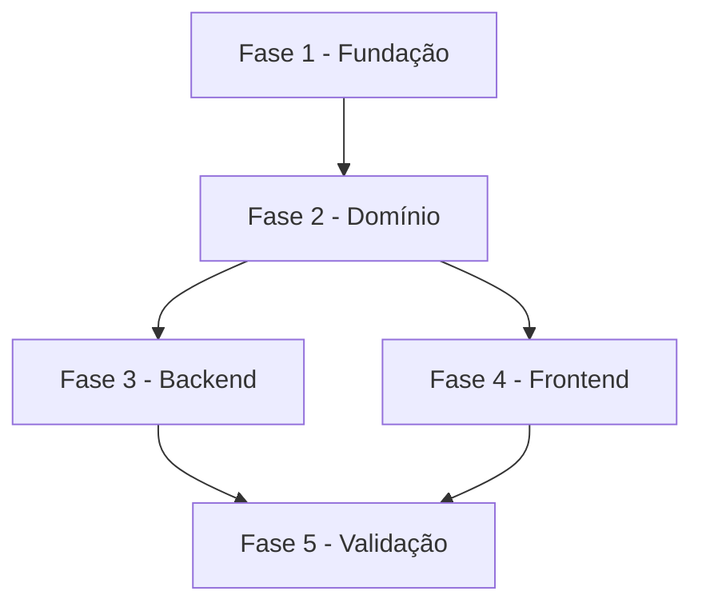

# Dev Pipeline - 7. Implementation - Create Tasks

## Overview

Crie um documento de backlog de tarefas técnicas seguindo um padrão estruturado de fases, tarefas, subtarefas, dependências, criticidade e cobertura de escopo.

## Pré-requisitos

**Recomendado (fluxo SDD)**: `spec.md` e `plan.md` já existentes em `docs/specs/{feature-short-name}/`. Com eles, o backlog se liga a requisitos, decisões técnicas e fases de implementação claras.

**Opcional**: checklists em `docs/specs/{feature-short-name}/checklists/*.md`. Gaps abertos nesses checklists devem virar tarefas explícitas no backlog.

**Alternativa standalone**: descrição textual do escopo, documento de referência ou lista de funcionalidades. Nesse caso, salve em `docs/tasks-{scope}.md`, salvo override explícito do usuário.

## When To Use

Use quando o usuário quiser transformar uma spec, plano técnico, documento de referência ou escopo textual em um backlog executável.

Não use para criar a spec funcional, clarificar requisitos, criar plano técnico, executar tarefas, revisar tarefas já executadas ou validar comportamento de implementação.

## Output Contract

O resultado principal é:

- `docs/specs/{feature-short-name}/tasks.md`, quando a origem for uma spec em `docs/specs/{feature-short-name}/`.
- `docs/tasks-{scope}.md`, quando a origem for standalone.
- Caminho indicado pelo usuário, quando houver override manual explícito.

O documento deve conter cabeçalho, legendas, fases, tarefas, subtarefas, matriz de dependências, resumo quantitativo, escopo coberto e escopo excluído.

## Workflow

1. **Origem**: detectar se o pedido vem de uma spec ou é standalone.
2. **Contexto**: ler spec, plan, checklists e documentos de referência relevantes.
3. **Gaps**: transformar gaps abertos de checklist em tarefas rastreáveis.
4. **Estrutura**: propor fases, dependências e caminho crítico ao usuário antes de detalhar.
5. **Decomposição**: quebrar fases em tarefas e subtarefas técnicas.
6. **Priorização**: classificar criticidade e ordenar execução.
7. **Geração**: produzir `tasks.md` usando `templates/tasks.md`.
8. **Validação**: checar completude, numeração, criticidade, testes e conformidade estrutural.
9. **Salvamento**: salvar no caminho correto e reportar próximos passos.

## Próximos Passos

1. `Dev Pipeline - 8. Implementation - Analyze` - validar consistência entre spec, plan, checklist e tasks.
2. `Dev Pipeline - 9. Implementation - Execute Task` - começar execução pela primeira tarefa crítica ou de fundação.
3. `Dev Pipeline - 10. Implementation - Review Task` - acompanhar progresso conforme tarefas forem concluídas.

## ETAPA 1: ORIGEM

### 1.1 Interpretar Argumento

Analise o argumento fornecido. Ele pode ser:

1. **Descrição do escopo**: descrição textual do que o MVP, projeto ou incremento deve cobrir.
2. **Documento de referência**: arquivo existente com requisitos, casos de uso, especificações ou decisões técnicas.
3. **Lista de funcionalidades**: features, módulos ou capacidades que precisam ser organizadas em tarefas.
4. **Spec SDD**: referência direta ou indireta a `docs/specs/{feature-short-name}/spec.md`.

### 1.2 Detectar Spec vs Standalone

Antes de iniciar, determine a origem:

1. Verifique se o argumento referencia um arquivo em `docs/specs/`, por exemplo `docs/specs/foo/spec.md`.
2. Verifique se o argumento menciona o nome de uma spec existente, listando `docs/specs/*/spec.md`.
3. Se a conversa indica que uma spec foi criada ou usada recentemente, considere-a como origem, desde que o caminho exista.

Se originado de uma spec:

- Salvar em `docs/specs/{feature-short-name}/tasks.md`.
- Usar `spec.md` como documento de referência principal.
- Usar `plan.md` se existir.
- Usar checklists existentes como fonte de gaps.

Se chamado de forma isolada:

- Salvar em `docs/tasks-{scope}.md`.
- Usar o argumento e documentos indicados como fonte principal.

Override manual do usuário sempre prevalece sobre os caminhos padrão.

## ETAPA 2: CONTEXTO

### 2.1 Ler Artefatos

Para origem SDD, carregar apenas as seções relevantes de:

- `docs/specs/{feature-short-name}/spec.md` - requisitos, user stories, entidades, success criteria e edge cases.
- `docs/specs/{feature-short-name}/plan.md` - arquitetura, contratos, modelo de dados, estrutura de projeto e cenários de validação.
- `docs/specs/{feature-short-name}/checklists/*.md` - gaps, ambiguidades, conflitos e pendências humanas que impliquem trabalho.
- `docs/constitution.md`, se existir - princípios de governança que afetam decomposição e prioridade.
- `AGENTS.md`, `README.md` e documentação local, quando forem relevantes para padrões do projeto.

Para origem standalone, ler os documentos explicitamente indicados pelo usuário e procurar documentação adjacente quando o caminho sugerir um projeto ou módulo específico.

### 2.2 Consumir Gaps Abertos do Checklist

Se a origem é uma spec, antes de decompor leia `docs/specs/{feature-short-name}/checklists/*.md` e colete itens ainda abertos marcados como `[Gap]`, `[Conflict]`, `[Ambiguity]` ou `{humano}` pendentes que impliquem trabalho.

Cada item deve virar uma tarefa de resolução no backlog, normalmente em uma fase inicial de fundação, requisitos ou alinhamento, com referência como:

```markdown
Ref: checklists/{domain}.md CHK0NN
```

Razão: o checklist roda antes do backlog no pipeline. Se os gaps não forem consumidos aqui, eles morrem no checklist e a feature pode ser implementada sobre requisito incompleto.

## ETAPA 3: ESTRUTURA

### 3.1 Propor Fases Antes de Detalhar

Antes de escrever todas as tarefas, proponha a estrutura de fases ao usuário quando o escopo for grande, ambíguo ou multi-módulo. Para escopos pequenos e claros, você pode seguir com a decomposição diretamente e reportar a estrutura adotada.

Fases devem seguir uma ordem lógica de construção:

```text
FASE 1 - Fundação
FASE 2 - Domínio
FASE 3 - Backend
FASE 4 - Integração
FASE 5 - Frontend
FASE 6 - Testes e Qualidade
FASE 7 - Observabilidade
```

Adapte a estrutura às camadas reais do projeto. Para biblioteca, CLI, automação ou documentação, use fases equivalentes ao domínio em vez de forçar backend/frontend.

### 3.2 Documento Obrigatório

O documento deve conter todas as seções abaixo, nesta ordem:

1. **Cabeçalho** com título, escopo e legendas.
2. **Fases** numeradas sequencialmente.
3. **Tarefas** dentro de cada fase, com numeração hierárquica.
4. **Subtarefas** como checkboxes.
5. **Matriz de Dependências** em Mermaid ou ASCII.
6. **Resumo Quantitativo** com totais por fase.
7. **Escopo Coberto**.
8. **Escopo Excluído**.

Use `templates/tasks.md` como base.

## ETAPA 4: DECOMPOSIÇÃO

### 4.1 Nomenclatura

| Nível | Formato | Exemplo |
|-------|---------|---------|
| Fase | `FASE {N} - {Nome}` | `FASE 1 - Fundação e Infraestrutura` |
| Tarefa | `{N}.{M} {Nome} [{Criticidade}]` | `1.1 Setup do Projeto [A]` |
| Subtarefa | `{N}.{M}.{K} {Descrição}` | `1.1.1 Criar estrutura inicial do módulo` |

### 4.2 Granularidade

| Nível | Critério | Tamanho Ideal |
|-------|----------|---------------|
| Fase | Agrupamento lógico por domínio, camada ou etapa | 3-8 tarefas |
| Tarefa | Entregável coeso e independente | 3-15 subtarefas |
| Subtarefa | Ação atômica executável | 1-4 horas |

### 4.3 Princípios

1. Cada subtarefa deve ser atômica, clara e verificável.
2. Cada tarefa deve ser coesa e reunir subtarefas do mesmo entregável.
3. Cada fase deve ser sequenciável e ter dependências claras.
4. Subtarefas herdam a criticidade da tarefa pai.
5. Tarefas devem referenciar documentação existente quando houver origem rastreável.
6. Toda tarefa de implementação deve ter subtarefa de teste, validação ou verificação.

### 4.4 Classificação de Criticidade

| Nível | Critério | Quando Usar |
|-------|----------|-------------|
| `[C]` Crítico | Impacto financeiro, regulatório, segurança, SLA ou operação bloqueante | Operações monetárias, compliance, autorização, migração crítica |
| `[A]` Alto | Funcionalidade core sem a qual o sistema não opera | APIs principais, persistência, integração essencial, fluxo principal |
| `[M]` Médio | Necessário, mas adiável sem impacto imediato | Dashboards, relatórios, cache, observabilidade, refinamentos |

Criticidade não é urgência subjetiva; é impacto caso a tarefa falhe ou fique incompleta.

## ETAPA 5: DEPENDÊNCIAS

Use Mermaid ou ASCII para expressar dependências reais:



A matriz deve refletir a ordem real de execução. Se o diagrama contradiz as fases, revise a decomposição.

## ETAPA 6: SINCRONIZAÇÃO COM CÓDIGO

`tasks.md` é a fonte de verdade declarada para execução. Em execuções longas, código e documento tendem a divergir; por isso, cada executor deve manter o backlog sincronizado.

### 6.1 Antes de Executar

Antes de executar uma tarefa, verificar se subtarefas pendentes já foram realizadas no código ou na documentação. Se já existem, marcar `[x]` com nota curta de evidência.

```markdown
- [x] 1.1.3 Implementar UserRepository <!-- validado no código existente -->
```

### 6.2 Trabalho Emergente

Quando uma decisão durante a execução criar trabalho novo, inserir a nova tarefa ou subtarefa no `tasks.md` no mesmo ciclo em que a decisão for registrada.

Formato sugerido:

```markdown
### N.M {Nome da Tarefa Emergente} `[A]`

Ref: decisão tomada durante execução de N.K

- [ ] N.M.1 {subtarefa nova}
- [ ] N.M.2 {subtarefa nova}
- [ ] N.M.3 {subtarefa nova}
```

### 6.3 Paridade de Tipos Compartilhados

Quando uma tarefa replica tipos entre camadas ou pacotes, incluir subtarefas explícitas de paridade:

```markdown
- [ ] N.M.1 Replicar tipo Foo em web/src/types/foo.ts
- [ ] N.M.2 Verificar paridade exata com packages/shared-types/src/foo.ts
- [ ] N.M.3 Criar teste smoke comparando opções e shape serializado
```

Essa verificação evita drift entre contratos, mocks e payloads reais.

## ETAPA 7: VALIDAÇÃO

Antes de finalizar o documento, verifique:

- [ ] Todas as fases têm pelo menos 1 tarefa.
- [ ] Todas as tarefas têm pelo menos 3 subtarefas, salvo justificativa explícita.
- [ ] Todas as tarefas têm tag de criticidade `[C]`, `[A]` ou `[M]`.
- [ ] Subtarefas de teste existem para tarefas de implementação.
- [ ] Numeração hierárquica está consistente e sem saltos.
- [ ] Matriz de dependências reflete ordem real de execução.
- [ ] Resumo quantitativo bate com a contagem real.
- [ ] Escopo coberto e escopo excluído estão documentados.
- [ ] Referências a documentação existente estão corretas.
- [ ] Gaps de checklist foram consumidos ou justificados.

Quando possível, rode:

```bash
sh scripts/validate-tasks-template.sh docs/specs/{feature-short-name}/tasks.md --config config.json
```

Se estiver executando fora do diretório desta skill, use o caminho completo para `scripts/validate-tasks-template.sh` e `config.json`.

## ETAPA 8: SALVAMENTO

Salvar o arquivo no caminho correto:

- Origem de spec: `docs/specs/{feature-short-name}/tasks.md`.
- Origem standalone: `docs/tasks-{scope}.md`.
- Override manual: caminho informado pelo usuário.

Ao finalizar, reporte:

```markdown
## Backlog Criado

**Arquivo**: [caminho]
**Origem**: spec / standalone / documento de referência
**Fases**: [N]
**Tarefas**: [N]
**Subtarefas**: [N]
**Gaps de checklist consumidos**: [N]

### Próximos Passos

1. `Dev Pipeline - 8. Implementation - Analyze` - validar consistência entre artefatos.
2. `Dev Pipeline - 9. Implementation - Execute Task` - iniciar pela primeira tarefa crítica desbloqueada.
```

## Configuração

`config.json` no diretório desta skill pode customizar:

- `criticality_levels` - tags e descrições de criticidade.
- `output_paths.spec_derived` e `output_paths.standalone` - caminhos de salvamento.
- `phase_prefix` - prefixo de fase, por padrão `FASE`.
- `subtask_granularity_hours` - janela esperada de esforço por subtarefa.

Se `config.json` estiver ausente, usar os defaults documentados no template.

## Scripts Auxiliares

- `scripts/next-task-id.sh` calcula o próximo ID hierárquico dentro de uma fase ou tarefa em um `tasks.md` existente.

```bash
sh scripts/next-task-id.sh 1 tasks.md
sh scripts/next-task-id.sh 1.2 tasks.md
```

- `scripts/validate-tasks-template.sh` valida conformidade estrutural com `templates/tasks.md`.

```bash
sh scripts/validate-tasks-template.sh docs/specs/foo/tasks.md --config config.json
```

## Gotchas

### Detecção de origem é obrigatória antes de escolher o path

Se a chamada veio de uma spec em `docs/specs/{feature-short-name}/`, o `tasks.md` vai em `docs/specs/{feature-short-name}/tasks.md`, não em `docs/tasks-*.md`. Criar o arquivo fora do diretório da spec quebra a composição do pipeline.

### Toda tarefa de implementação precisa de subtarefa de teste

Decomposição sem teste ou verificação é incompleta. Se a tarefa é "Implementar endpoint X", deve haver subtarefa como "Escrever teste de integração para endpoint X" ou "Validar contrato do endpoint X".

### Criticidade em todas as tarefas

Tarefa sem criticidade não permite priorização. `[C]` não significa "importante em geral"; significa impacto financeiro, regulatório, segurança, SLA ou operação bloqueante.

### Subtarefa deve caber em 1-4 horas

Subtarefa gigante é tarefa disfarçada. Se uma subtarefa parece multi-dia, decomponha em ações menores e verificáveis.

### Referenciar documentação existente

Tarefa órfã sem `Ref:` perde contexto quando alguém executa semanas depois. Se existe UC, ADR, spec, checklist ou decisão que origina a tarefa, referencie explicitamente.

### Escopo excluído não é o mesmo que fora do MVP

Escopo excluído é algo explicitamente fora deste backlog e precisa de justificativa. Fora do MVP pode ser trabalho futuro; documente essa diferença quando ela importar.

### Template drift é silencioso

Quando o backlog é produzido sem seguir `templates/tasks.md`, é fácil omitir checkboxes, legendas, matriz de dependências, resumo quantitativo ou seções de escopo. Rode `scripts/validate-tasks-template.sh` quando gerar ou revisar um `tasks.md`.
