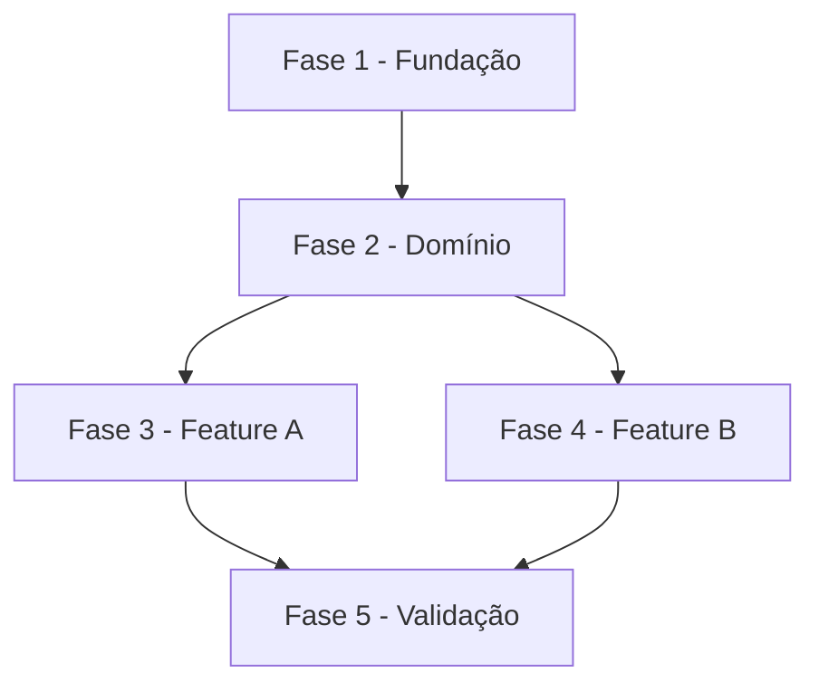

# Tarefas {Nome do Projeto} - {Escopo}

Escopo: {Descrição concisa do que este backlog cobre}

**Legenda de status:**
- `[ ]` Pendente
- `[~]` Em andamento
- `[x]` Concluído
- `[!]` Bloqueado

**Legenda de criticidade:**
- `[C]` Crítico - Impacto financeiro direto, regulatório, segurança, SLA ou operação bloqueante
- `[A]` Alto - Funcionalidade essencial
- `[M]` Médio - Necessário, mas sem urgência imediata

---

## FASE {N} - {Nome da Fase}

### {N}.1 {Nome da Tarefa} `[A]`

Ref: {Referência a spec, checklist, UC, ADR ou documento, se aplicável}

- [ ] {N}.1.1 {Descrição da subtarefa}
- [ ] {N}.1.2 {Descrição da subtarefa}
- [ ] {N}.1.3 {Descrição da subtarefa}

### {N}.2 {Nome da Tarefa} `[M]`

Ref: {Referência a spec, checklist, UC, ADR ou documento, se aplicável}

- [ ] {N}.2.1 {Descrição da subtarefa}
- [ ] {N}.2.2 {Descrição da subtarefa}
- [ ] {N}.2.3 {Descrição da subtarefa}

---

## Matriz de Dependências

## Resumo Quantitativo

| Fase | Tarefas | Subtarefas | Criticidade |
|------|---------|------------|-------------|
| 1 - {Nome} | {N} | {N} | {C\|A\|M} |
| **Total** | **{N}** | **{N}** | - |

## Escopo Coberto

| Item | Descrição | Fase |
|------|-----------|------|
| {ID} | {O que está incluído} | {N} |

## Escopo Excluído

| Item | Descrição | Motivo |
|------|-----------|--------|
| {ID} | {O que foi excluído} | {Justificativa} |
